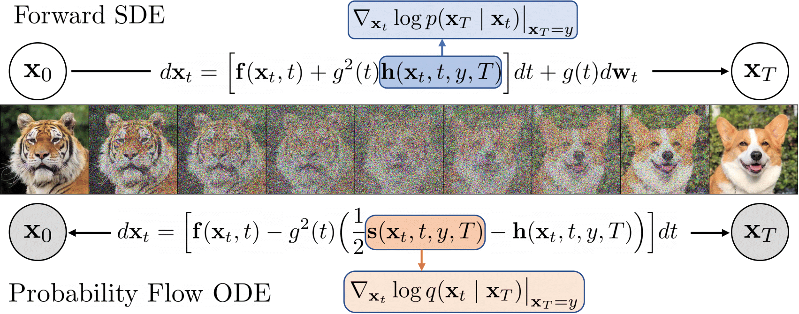

# Denoising Diffusion Bridge Models (ICLR 2024)

Implementation of [Denoising Diffusion Bridge Models](https://arxiv.org/abs/2309.16948). 

<p align="center">
  
</p>

Goal of this project is to create core for future research projects based on bridge models.

Code is based on the official implementation: [ddbm](https://github.com/alexzhou907/DDBM) and have simplified interface in training and sampling using `torchrun` commands instead of `mpi`, and also enables training and sampling on custom pairwise datasets.


# Dependencies

```
1. conda create -n ddbm python=3.12
2. conda activate ddbm
3. pip install -r requirements.txt
```

# Datasets

Code is reorganized to work with custom datasets. As an example, [pix2pix](https://github.com/junyanz/pytorch-CycleGAN-and-pix2pix/blob/master/docs/datasets.md) datasets are utilized for trainings and samplings.

Dataset prepearing is at `pix2pix_utils.py`

# Train & sample

To run training (you can also use one device):
```
torchrun --nproc_per_node=2 --nnodes=1 ddbm_train_dist.py --devices 0 1
```

To run sampling:
```
torchrun --nproc_per_node=1 --nnodes=1 ddbm_sample_dist.py --devices 0
```

Example of retriving sampling results you can find at `ddbm.ipynb`.

# Citation

```bibtex
@article{zhou2023denoising,
  title={Denoising diffusion bridge models},
  author={Zhou, Linqi and Lou, Aaron and Khanna, Samar and Ermon, Stefano},
  journal={arXiv preprint arXiv:2309.16948},
  year={2023}
}
```
